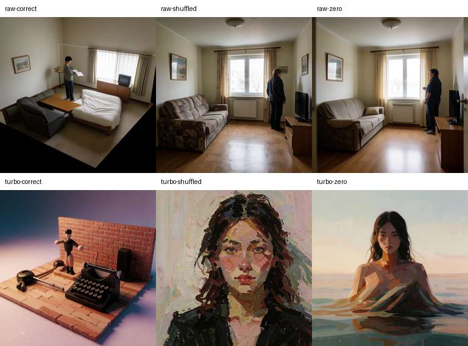
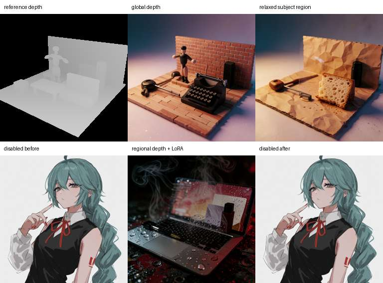

# Depth validation and benchmark status

Date: 2026-07-30

## Result

Gates A through E pass. The public Krea 2 depth checkpoint produces a strong,
repeatable response in both Raw and Turbo, regional soft weighting works
without a rectangular seam, and a depth-enabled generation leaves the
depth-disabled path pixel-identical afterward. Production feature flags remain
off. A bounded Gate F diagnostic classifies two pre-existing test hangs as a
deterministic host-infrastructure incompatibility. The narrow host-only waiver
was explicitly approved; clean-container and CI results remain mandatory.

The live run used an NVIDIA A40 (46,068 MiB), Torch 2.9.1+cu128, a 50 GB Pod
memory limit, and checkpoint SHA-256
`fb80547ed79b47c1e3fea7bb9d36297e3917b2115fab6700ca1501350f9f483c`.
The A40 does not expose the scaled-FP8 optimization used on newer compute
capabilities, but every 1024×1024 case completed without OOM recovery.

## Global checkpoint response

All cases used the same prompt, seed `20260730`, dimensions, mode settings, and
base artifacts. “Zero” is a neutral projected control at strength zero; a
fully depth-disabled baseline is checked separately under integration.

| Mode/control | Load (s) | Generate (s) | Completed memory | OOM |
| --- | ---: | ---: | --- | --- |
| Raw correct | 111.5 | 121.0 | 8.0 GiB GPU reserved; 15.7 GiB RAM free | no |
| Raw shuffled | 85.3 | 113.8 | 8.0 GiB GPU reserved | no |
| Raw zero | 64.9 | 112.2 | 8.0 GiB GPU reserved | no |
| Turbo correct | 18.6 | 122.5 | 30.8 GiB GPU reserved; 13.2 GiB GPU free | no |
| Turbo shuffled | 6.0 | 42.4 | 30.8 GiB GPU reserved | no |
| Turbo zero | 6.2 | 42.5 | 30.8 GiB GPU reserved | no |

The first generation in each mode includes cold-start/warm-up effects, so its
generation time is not a steady-state comparison. Raw ran with 28 steps,
CFG 3.5, and dynamic VRAM; Turbo ran with 8 steps, CFG 0, and high VRAM.

Depth Anything V2 Small estimated output depth for the metrics below. Both
estimated-depth polarities were evaluated. Correct depth wins three of four
structural metrics in Raw and all four in Turbo:

| Case | Depth corr. | Rank corr. | Edge alignment | Edge IoU |
| --- | ---: | ---: | ---: | ---: |
| Raw correct | 0.149 | **0.282** | **0.139** | **0.223** |
| Raw shuffled | **0.404** | 0.116 | 0.027 | 0.092 |
| Raw zero | 0.310 | 0.151 | 0.018 | 0.068 |
| Turbo correct | **0.308** | **0.658** | **0.462** | **0.353** |
| Turbo shuffled | 0.179 | 0.296 | -0.007 | 0.071 |
| Turbo zero | 0.077 | 0.602 | 0.027 | 0.044 |

Raw shuffled’s larger scalar correlation comes from a broad coincidental room
gradient. It loses rank consistency, boundary alignment, and silhouette
overlap. This illustrates why the acceptance decision does not use correlation
alone. Visual inspection confirms that both correct controls recover the
reference’s slanted ground plane, near furniture, standing figure, and rear
wall. Shuffled and zero controls do not.

## Integration and regional checks

A single loaded Turbo runtime generated:

1. depth disabled;
2. depth enabled with one relaxed subject region and the ordinary
   `krea2_turbo_distill_r256` LoRA;
3. depth disabled again.

The first and third decoded RGB arrays have the identical SHA-256
`db5a0db6aeecd807f3eaf4bc83d3341cb3f174b07dca03cb4d3db1cb5ac9349e`.
This proves the control adapter and ordinary LoRA do not leave stale mutation
on the baseline model. The ordinary LoRA matched and applied all 265 targets;
the depth adapter matched all 224 targets and loaded all 448 LoRA tensors.

The relaxed subject region used multiplier 0.2 within global strength 1.0 and
32-pixel feathering. Across all eight sampler transitions its token field had
minimum 0.2, maximum 1.0, and mean 0.9394. In the unconfounded visual pair the
figure diverges inside the relaxed region while the platform, back wall, and
outside-region layout remain continuous. No rectangular seam is visible.

The first sequential attempt exposed an inference-lifecycle defect when depth
encoding followed a previous generation. Control VAE encoding is now explicitly
inside `torch.inference_mode()`, with a regression test. The exact sequence
then passed.

## Blender and local regression evidence

- The public checkpoint has 450 tensors, one expanded `first.weight`, rank 64,
  and 224/224 required block-target pairs.
- The deterministic Blender reference export is true `uint16`, 256×256,
  non-constant depth. Repeated exports had zero differing depth pixels and zero
  differing object-ID pixels.
- The reference bundle records camera intrinsics/extrinsics and verifies image
  checksums, resolution, bundle version, and depth convention on import.
- The shared k2core suite previously completed with 225 passing tests, two
  environment skips, and 14 subtests.
- The K2Lab focused depth, project, worker, web-control, and ordinary regional
  selections previously completed with 131 passing tests, expected
  Torch-environment skips, and six subtests.
- The fixed 11-scene/variant/metric matrix is recorded in
  `depth-evaluation-suite.json`.
- Full numerical live evidence is in
  `depth-validation/a40-live-validation.json`.

## Final verification

- Repository-wide Ruff: pass.
- Depth evaluator, validation harness, runtime, and adapter selection: 15 pass,
  three expected no-Torch skips on the local host.
- Clean Ubuntu 24.04 full suite: 305 pass, 15 expected
  accelerator/live-billing skips, 16 subtests.
- Shared k2core feature branch: 225 pass, two environment skips, 14 subtests
  from the completed feature-branch sweep.
- Studio project contract, including schema-v24 depth round trip and v23
  disabled migration: pass.
- Studio UI contract: pass.
- TypeScript and production Vite build: pass.
- Live A40 Raw/Turbo, sequential cleanup, global LoRA coexistence, and regional
  visual checks: pass.

The restricted host's full 320-test invocation reaches the control-plane tests
and then blocks. Independently, both
`test_audit_store_redacts_nested_secrets_and_authenticated_urls` and
`test_chunked_upload_resumes_verifies_and_updates_inventory` fail to terminate
under bounded execution on this feature branch, stable `main`, and the
pre-depth feature commit. Both pass individually and in both orders in clean
Ubuntu 24.04 containers, including one with exact host dependency versions.
The full clean-container suite passes.

Thread/task dumps show the main event loop asleep after an idle SQLite or
executor worker has completed its work. A repository-independent
`loop.call_soon_threadsafe` reproduction confirms that this host context loses
the selector wakeup until an unrelated timer fires. Branch modules are imported
during app setup, but executed-line tracing does not reach the depth payload
code. The complete evidence, exact commands, timeout behavior, and residual
risk are in `test-hang-diagnostic/REPORT.md`. Gate F is accepted through that
approved narrow waiver, subject to a green final merge-candidate container run.

Production rollout remains reversible: all four depth feature flags default to
false, legacy projects load with depth disabled, and removing the flags and
checkpoint restores the old request path.
